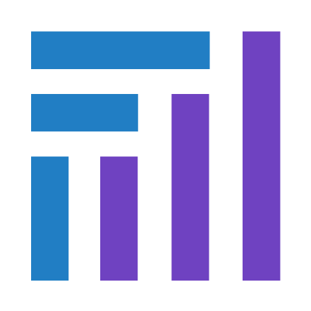

# 

# Fabrizio Marras (PhD)

I am an Italian professional, living in the Netherlands. 
I hold a PhD in Chemistry from the University of Amsterdam. I have a strong background in IT, software/web/app development, project management, (graphic) design, animation and a drive for learning and growth.

## My skills
<!--
Link for logos of Tech Stack:
https://github.com/simple-icons/simple-icons/blob/master/slugs.md
-->

  
  
  
  
  
  
  
  
  
  
  
  
  
  
  
  
  
  
  
  
  
  
  
  

  
  
  
  
  
  
  
  
  

 

## My GitHub contributions

<!--
**FabrizioMarras/FabrizioMarras** is a ✨ _special_ ✨ repository because its `README.md` (this file) appears on your GitHub profile.

Here are some ideas to get you started:

- 🔭 I’m currently working on ...
- 🌱 I’m currently learning ...
- 👯 I’m looking to collaborate on ...
- 🤔 I’m looking for help with ...
- 💬 Ask me about ...
- 📫 How to reach me: ...
- 😄 Pronouns: ...
- ⚡ Fun fact: ...

-->

